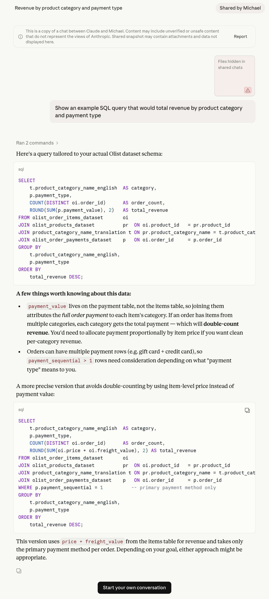

When I generate an analysis notebook figure or table with an LLM I just want to
move forward with the result. I don’t want to spend time grading the LLM’s homework.
There’s no reward for checking the analysis of an LLM - emotionally or from my
colleagues. Sharing analysis graphs and figures are what I get paid to generate,
and the expectation with LLMs is that I generate them faster. Even before LLMs
became much better around November 2025, I knew that faster, more responsive
analysis gets rewarded over slower, more thoughtful analysis. That’s been true
of the industry as long as I’ve been in it. The speed at which LLMs can generate
results, and the accompanying expectations, have just compounded this.

I’ve noticed that the pre-LLM friction of having to write analysis myself was a
form of protection. Having to type everything caused me to subconsciously think
about what I was doing, without conscious effort. It was a process running in
the background. Now with LLMs that background thinking is gone. I have to do it
consciously, and I’m being nudged by the LLM not to. Even before LLMs became
good-enough, I usually felt that I should spend more time thinking ahead.

Here’s a concrete example using publicly available real e-commerce data
([Olist][], 100K orders from a Brazilian e-commerce startup). I gave an LLM this
data and asked:

> Show an example SQL query that would total revenue by product category and
> payment type



[olist]: https://www.kaggle.com/datasets/olistbr/brazilian-ecommerce

This is the kind of question an analyst might ask. Category lives in the
`order_items` table. Payment type lives in the `payments` table. Both are keyed
to `order_id`. The natural SQL joins them directly. The LLM identified a
potential fan-out issue: where the join would incorrectly create additional rows
at the wrong grain. The grain of the data, what each row represents, matters
here. The orders table has one row per order. The payments table has one row per
payment charge - an order paid with a credit card and two vouchers has three
rows. Join that to a multi-item order naively and the payment values multiply,
inflating the revenue. The LLM caught this, but its fix introduced a subtler
problem. The cognitive danger with using the LLMs is that here it identified a
grain issue, and therefore my unconscious bias is that there are no other issues
in the generated analysis. Especially when the LLM sells it in very positive
language. However if I manually checked this analysis myself I would find a
second subtle bug that affects 2.3% of orders. Not impactful perhaps, but
incorrect — and presented confidently.

So what's the fix? Not a better prompt — adding back the friction that LLMs
strip away.

Unless the analysis ask is very simple, I always start with planning mode first.
Planning mode adds a little helpful friction back in: reading the plan. While
I’m reading, I’m thinking and not doing. Anyone who’s ever reviewed someone
else’s code, knows that the perspective is different. Using planning mode is a
good trigger for this shift. Specifically when I do planning mode, I have a
[Claude exit hook][claude exit hook], this asks the LLM questions like:

[claude exit hook]:
  https://github.com/michaelbarton/dotfiles/blob/master/claude/hooks/plan-review.sh

- What are the exit criteria, what does success look like?
- What are the invariants and grain of the data?
- What are the potential failure modes?

All of these questions are about fighting bias, mine and the LLMs. Kahneman
might call this System 1 versus System 2. The LLM wants to think fast. I’m
trying to think slow. Including these questions almost always shows a gap in the
LLM’s thinking - to the extent it makes me worried about code I generated before
including these questions in the plan. These questions often surface assumptions
that I didn’t know I, or the LLM, was making.

Going back to the beginning of this article - working with LLMs has become about
managing my mental effort as a limited resource. The harder I make it for myself
to check the work of the LLMs the less likely I am. And the faster the LLM
generates, the harder it gets.

## Appendix

You don't need to read this appendix to understand the point I'm making in this
article. This section is here if you want to get into the details about how
subtle bugs can show up due to data grain misunderstanding. Exactly the type of
issue that current generation of frontier LLMs still seem to struggle with.
I didn't get a chance to try with Fable, but perhaps someone could try using the
original prompt as above, and see how it performs.

```{python}
# | echo: false
# | output: false
import duckdb
from IPython.display import display, HTML

conn = duckdb.connect("data/olist.duckdb", read_only=True)
```

```{python}
# | echo: false
# | label: tbl-data-overview
# | tbl-cap: "Three tables in the Olist data at three different grains."
conn.sql("""
    select
      'orders' as "Table",
      count(*) AS "Rows",
      count(distinct order_id) AS "Unique Orders",
      'One row per order' AS "Grain"
    from orders

    union all

    select
      'order_items',
      count(*),
      count(distinct order_id),
      'One row per item in an order'
    from order_items

    union all

    select
      'payments',
      count(*),
      count(distinct order_id),
      'One row per payment charge'
    from payments
""").df()
```

Joining `order_items` to `payments` on `order_id` produces a many-to-many
fan-out: every item row × every payment row. The LLM identifies this immediately
in the first proposed query.

```sql
-- Note: this query is wrong
SELECT
    pr.product_category_name AS category,
    p.payment_type,
    COUNT(DISTINCT oi.order_id) AS order_count,
    ROUND(SUM(p.payment_value), 2) AS total_revenue
FROM order_items oi
JOIN products pr ON oi.product_id = pr.product_id
JOIN payments p ON oi.order_id = p.order_id
GROUP BY pr.product_category_name, p.payment_type
ORDER BY total_revenue DESC;
```

The LLM flagged the fan-out and proposed switching to `price + freight_value`
from the items table, filtered to the primary payment method:

```sql
-- Note: this query is still wrong, but more subtly so
SELECT
    pr.product_category_name AS category,
    p.payment_type,
    COUNT(DISTINCT oi.order_id) AS order_count,
    -- here the LLM has updated total revenue to include freight_value
    ROUND(SUM(oi.price + oi.freight_value), 2) AS total_revenue
FROM order_items oi
JOIN products pr ON oi.product_id = pr.product_id
JOIN payments p ON oi.order_id = p.order_id
-- filter to primary payment method only
WHERE p.payment_sequential = 1
GROUP BY pr.product_category_name, p.payment_type
ORDER BY total_revenue DESC;
```

This avoids the inflation but misattributes revenue for orders split across
payment types. Here's a concrete example of how this can go wrong:

```{python}
# | echo: false

example_order = conn.sql("""
    SELECT order_id FROM payments
    GROUP BY order_id
    HAVING COUNT(DISTINCT payment_type) > 1
    ORDER BY order_id
    LIMIT 1
""").fetchone()[0]

payments_html = conn.sql(f"""
    SELECT payment_sequential, payment_type, payment_value
    FROM payments WHERE order_id = '{example_order}'
    ORDER BY payment_sequential
""").df().to_html()

items_html = conn.sql(f"""
    SELECT order_item_id, price, freight_value
    FROM order_items WHERE order_id = '{example_order}'
""").df().to_html()

display(HTML(f"""
<figure>
<figcaption>Table 2: An order split across credit card and voucher</figcaption>
<p><strong>Order:</strong> <code>{example_order}</code></p>
<p><strong>Payments</strong></p>
{payments_html}
<p><strong>Items</strong></p>
{items_html}
</figure>
"""))
```

The second query however attributes all item revenue to
`payment_sequential = 1`, so vouchers which are `payment_sequential = 2`
disappear from the breakdown:

```{python}
# | echo: false
# | label: split-payment-impact

split_orders, total_orders = conn.sql("""
    SELECT
        (SELECT COUNT(*) FROM (
            SELECT order_id FROM payments
            GROUP BY order_id HAVING COUNT(DISTINCT payment_type) > 1)),
        (SELECT COUNT(DISTINCT order_id) FROM payments)
""").fetchone()

print(
    f"Orders with split payment types: {split_orders:,} ({split_orders/total_orders:.1%} of all orders)"
)
```

```{python}
# | echo: false
# | label: voucher-misattribution

llm_voucher, llm_total = conn.sql("""
    SELECT
        SUM(CASE WHEN payment_type = 'voucher' THEN revenue END),
        SUM(revenue)
    FROM (
        SELECT p.payment_type, SUM(oi.price + oi.freight_value) AS revenue
        FROM order_items oi
        JOIN payments p ON oi.order_id = p.order_id
        WHERE p.payment_sequential = 1
        GROUP BY p.payment_type
    )
""").fetchone()

correct_voucher, correct_total = conn.sql("""
    SELECT
        SUM(CASE WHEN payment_type = 'voucher' THEN payment_value END),
        SUM(payment_value)
    FROM payments
    WHERE order_id IN (SELECT order_id FROM order_items)
""").fetchone()

print(
    f"Voucher revenue (LLM fix):    R${llm_voucher:>12,.2f}  ({llm_voucher/llm_total:.1%} of total)"
)
print(
    f"Voucher revenue (correct):    R${correct_voucher:>12,.2f}  ({correct_voucher/correct_total:.1%} of total)"
)
print(f"Misattributed:                R${correct_voucher - llm_voucher:>12,.2f}")
```

The fix has a third, quieter problem: some orders have no
`payment_sequential = 1` row at all, so the `WHERE` clause drops them entirely:

```{python}
# | echo: false
# | label: dropped-orders

no_seq1 = conn.sql("""
    SELECT COUNT(*) FROM (
        SELECT order_id FROM payments
        GROUP BY order_id
        HAVING SUM(CASE WHEN payment_sequential = 1 THEN 1 ELSE 0 END) = 0
    )
""").fetchone()[0]

print(f"Orders with no payment_sequential = 1: {no_seq1}")
```

The likely correct approach would allocate each order's payment across
categories proportionally by item price, accounting for vouchers, and
potentially other sequential payment types. I haven't added that query here, but
it starts to get more complex. If you're still reading here, then I think you
get the point already about the LLM getting it wrong with a naive prompt.

```{python}
# | echo: false
conn.close()
```
